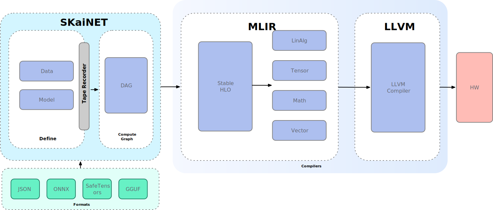

[](LICENCE)
[](https://central.sonatype.com/artifact/sk.ainet.core/skainet-lang-core)

# SKaiNET

**SKaiNET** is an open-source deep learning framework written in Kotlin Multiplatform, designed with developers in mind to enable the creation modern AI powered applications with ease.

## Use it

- From Kotlin code in apps, libraries, CLIs
- In Kotlin Notebooks for quick exploration
- With sample projects to learn patterns

See also CHANGELOG for what’s new in 0.5.0.

## Quick start

Gradle (Kotlin DSL):

```kotlin
dependencyResolutionManagement {
    repositories {
        mavenCentral()
    }
}

dependencies {
    // minimal dependency with simple CPU backend
    implementation("sk.ainet.core:skainet-lang-core:0.5.0")
    implementation("sk.ainet.core:skainet-backend-cpu:0.5.0")
    
    // simple model zoo
    implementation("sk.ainet.core:skainet-lang-models:0.5.0")
    
    // Optional I/O (e.g., GGUF loader, JSON)
    implementation("sk.ainet.core:skainet-io-core:0.5.0")
    implementation("sk.ainet.core:skainet-io-gguf:0.5.0")
}
```

Maven:

```xml
<dependency>
  <groupId>sk.ainet.core</groupId>
  <artifactId>skainet-lang-core</artifactId>
  <version>0.5.0</version>
</dependency>
```

## Samples and notebooks

- Sample app: https://github.com/sk-ai-net/skainet-samples/tree/feature/MNIST/SinusApproximator
- Kotlin Notebook: https://github.com/sk-ai-net/skainet-notebook

## Architecture



## 0.5.0 highlights (with tiny snippets)

- Kolmogorov–Arnold Networks (KAN/AKN) preview in the NN DSL

```kotlin
val model = nn {
    input(64)
    dense(out = 64)
    // KAN layer (preview) with residual when dims match
    kanLayer(outputDim = 64, gridSize = 16, useResidual = true)
    dense(out = 10)
}
```

- Training/Eval phases made easy

```kotlin
val base = DefaultNeuralNetworkExecutionContext() // default = EVAL
val yTrain = train(base) { ctx -> model.forward(x, ctx) }
val yEval  = eval(base)  { ctx -> model.forward(x, ctx) }
```

- Dropout and BatchNorm layers

```kotlin
val y = x
    .let { dropout(p = 0.1).forward(it, ctx) }
    .let { batchNorm(numFeatures = 64).forward(it, ctx) }
```

- Conv2D + MaxPool in the NN DSL

```kotlin
val model = nn {
    conv2d(outChannels = 16, kernel = 3)
    maxPool2d(kernel = 2)
    dense(out = 10)
}
```

- Data API with MNIST loader and JSON dataset support

```kotlin
val ds = MNIST.load(train = true) // platform-aware loader
val (batchX, batchY) = ds.nextBatch(64)
```

- GGUF model loading (initial)

```kotlin
val gguf = GGUF.read("/path/to/model.gguf")
println("Tensors: ${gguf.tensors.size}")
```

- SIMD/Vector API acceleration on JVM; MatMul, tril, pooling ops; forward hooks and simple tape recording; unified tensor creation contexts; nested data blocks returning tensors.

See CHANGELOG.md for the full list.

## Experimental: Kolmogorov–Arnold Networks (KAN)

SKaiNET includes an initial KAN layer implementation that you can wire into the NN DSL. A KAN layer expands each input feature by a learnable grid of basis coefficients and then mixes them with a linear projection, with optional bias and residual connection.

- Current status: experimental/preview. API and behavior may change.
- Forward path uses broadcasted basis expansion and a matmul mixing step.
- `gridSize`, `useBias`, `useResidual`, and a custom `baseActivation` are supported. The `degree` parameter is reserved for future spline/basis functions and is not yet used.

Quick usage example:

```kotlin
val model = nn {
    input(64)
    dense(out = 64)
    // Add a KAN layer that keeps the same dimensionality and uses a residual connection
    kanLayer(outputDim = 64, gridSize = 16, useResidual = true)
    dense(out = 10)
}
```

Notes and limitations:
- Works with the default CPU backend; performance tuning and specialized kernels may arrive later.
- Residuals are applied only when `outputDim == inputDim`.
- You can customize initializers for the mixing weights, basis, and bias via the DSL block.

See source for details:
- skainet-lang/skainet-kan/src/commonMain/kotlin/sk/ainet/lang/kan/KanDsl.kt
- skainet-lang/skainet-kan/src/commonMain/kotlin/sk/ainet/lang/kan/KanLayer.kt

## License

MIT — see LICENCE.
