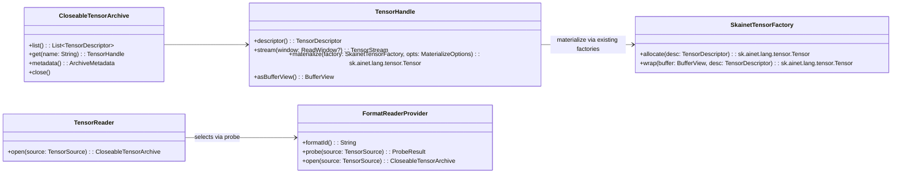

### Skainet IO Core: Thin Abstraction for Format-Independent Tensor Reading — Integrated with Skainet Tensor/DSL/Data Factories

#### Summary
A thin, extensible abstraction in skainet-io-core enables format-independent reading of tensors (metadata-first, lazy materialization, optional streaming, minimal copying). Concrete format modules (e.g., skainet-io-gguf, skainet-io-safetensors) implement the IO detail and plug in via a small SPI/Bridge. This document explicitly integrates with Skainet’s existing Tensor interface, Tensor DSL, and TensorData factories, so materialized tensors are native sk.ainet.lang.tensor types produced by the existing factories/strategies.

---

### Goals
- Provide a stable core API for reading tensor metadata and data regardless of file format.
- Ensure materialization returns sk.ainet.lang.tensor.Tensor<T,V> using existing factories (e.g., DenseTensorDataFactory) and strategies (copy vs lazy, etc.).
- Enable lazy, streaming, full materialization access patterns with minimal-copy/zero-copy where possible.
- Allow multiple versions of a format reader (e.g., gguf v2/v3) to coexist and be auto-selected.
- Leverage existing Tensor DSL for ergonomics when building or transforming tensors after IO.

### Non-goals
- Replace the skainet-lang tensor model or DSL — we reuse it.
- Mandate a single device/memory strategy — keep interop flexible (heap, direct, mmap).

---

### High-level Architecture (Bridge/SPI)



Note: SkainetTensorFactory here is a thin adapter over existing sk.ainet.lang.tensor factories and data factories; see Integration section.

---

### Mapping to Existing Skainet Tensor Model

We integrate directly with sk.ainet.lang.tensor and data factories:
- Tensor interface: sk.ainet.lang.tensor.Tensor<T : DType, V>
- Data factories: sk.ainet.lang.tensor.data.TensorDataFactory and concrete DenseTensorDataFactory
- DSL: sk.ainet.lang.tensor.dsl (TensorDsl, TensorBuilder, TensorInitializer)

IO → Tensor mapping
- IO DType → sk.ainet.lang.types.DType
- IO shape/strides → sk.ainet.lang.tensor.Shape and TensorView/TensorData stride representation
- IO buffer view → backing arrays/buffers for Dense*TensorData or wrapped ByteBuffers when supported

To avoid name clashes with internal helper types, note that skainet-io-core may define internal data class Tensor for JSON modeling (sk.ainet.io.json.Tensor); it is internal and separate. When referring to runtime tensors we always mean sk.ainet.lang.tensor.Tensor.

---

### Core IO Interfaces (conceptual)

These are IO-facing abstractions (kept thin). They do not reinvent the Tensor API; they serve bytes and metadata and let factories from skainet-lang build tensors.

- TensorReader.open(TensorSource): CloseableTensorArchive
- CloseableTensorArchive:
  - metadata(): ArchiveMetadata
  - list(): List<TensorDescriptor>
  - get(name): TensorHandle
- TensorHandle:
  - descriptor(): TensorDescriptor (name, dtype, shape, layout, byte size, extras)
  - stream(window?): TensorStream (for chunked reads)
  - asBufferView(): BufferView? (zero/min-copy path)
  - materialize(factory, options): delegates to SkainetTensorFactory which uses skainet-lang factories

MaterializeOptions connects to copy vs lazy strategies available in skainet-lang (see below).

---

### Using Existing TensorData Factories and Materialization Strategies

skainet-lang already includes:
- TensorDataFactory (sk.ainet.lang.tensor.data.TensorDataFactory) with DenseTensorDataFactory as a default
- Materialization strategies (e.g., CopyMaterializationStrategy, LazyMaterializationStrategy) that yield Tensor<T,V>

Recommended adapter in IO layer (pseudo-Kotlin):

```kotlin
// In skainet-io-core (or shared util), provide an adapter to skainet-lang factories
class SkainetTensorFactoryAdapter(
    private val dataFactory: sk.ainet.lang.tensor.data.TensorDataFactory,
    private val viewStrategy: sk.ainet.lang.tensor.TensorViewStrategy<*, *>? = null
) : SkainetTensorFactory {

    override fun allocate(desc: TensorDescriptor): sk.ainet.lang.tensor.Tensor<*, *> {
        // Create TensorSpec/Shape from desc
        val shape = sk.ainet.lang.tensor.Shape(desc.shape.toList())
        // Choose dtype-specific allocate using dataFactory
        return dataFactory.createEmpty(desc.dtype, shape)
    }

    override fun wrap(
        buffer: BufferView,
        desc: TensorDescriptor
    ): sk.ainet.lang.tensor.Tensor<*, *> {
        val shape = sk.ainet.lang.tensor.Shape(desc.shape.toList())
        // If dataFactory supports wrapping ByteBuffer with no copy, use it
        return dataFactory.wrap(desc.dtype, shape, buffer.asByteBuffer())
    }
}
```

Implementations choose copy or wrap based on MaterializeOptions and dataFactory capabilities. For platforms where zero-copy is not supported, fall back to copy using the CopyMaterializationStrategy from skainet-lang.

---

### Integration with Tensor DSL

After reading descriptors or materializing tensors, users can apply the Tensor DSL for creation and transformation. Example:

```kotlin
val reader = DefaultTensorReader()
val archive = reader.open(TensorSource.FilePath("model.safetensors"))
val weightsDesc = archive.list().first { it.name == "encoder.wq" }

val factory = SkainetTensorFactoryAdapter(DenseTensorDataFactory())
val wq: sk.ainet.lang.tensor.Tensor<*, *> = archive.get("encoder.wq").materialize(factory)

// Use Tensor DSL to build a bias tensor and add to weights
val bias = sk.ainet.lang.tensor.dsl.tensor<Float32> {
    shape(1, wq.shape.last())
    fill(0.01f)
}

val wqWithBias = wq + bias // using existing ops if available
```

This keeps IO concerns separate while ensuring that downstream code uses standard Skainet tensor types and DSL.

---

### Format Providers and Versioning

Format modules (skainet-io-safetensors, skainet-io-gguf) implement FormatReaderProvider and expose:
- formatId(): String (e.g., "safetensors", "gguf")
- probe(source): ProbeResult with confidence scoring (per version)
- open(source): CloseableTensorArchive that parses headers/index only and exposes TensorHandle objects for lazy access

Multiple providers for different internal versions can coexist; the highest confidence wins.

---

### Streaming, Random Access, and Zero-Copy

- stream(ReadWindow) supports chunked reads (good for remote/HTTP range).
- asBufferView() can expose memory-mapped/file-backed regions; Skainet data factories may wrap a ByteBuffer to avoid copies when:
  - the tensor is contiguous and aligned
  - endianness matches
  - consumer factory supports wrap(ByteBuffer)
- Otherwise, use a single-pass copy into a factory-allocated buffer.

---

### Example: SafeTensors on JVM with Memory Mapping

skainet-io-safetensors provides MemoryMappedSafeTensorsReader which:
- Parses header and index on open
- For each tensor, exposes a TensorHandle with:
  - descriptor() built from header metadata
  - asBufferView() returning an mmap-backed BufferView when possible
  - stream() implemented via FileChannel and ranges

Materialization using existing factories:

```kotlin
val archive = MemoryMappedSafeTensorsReader.fromFilePath("model.safetensors")
val d = archive.list().first()
val t = archive.get(d.name).materialize(
    SkainetTensorFactoryAdapter(DenseTensorDataFactory())
)
```

---

### Error Handling and Validation
- probe failures return ProbeResult(supported=false) without throwing.
- open may throw InvalidFormatException or IOExceptions.
- MaterializeOptions.validateChecksum can trigger streaming verification without forcing copy.

---

### Concurrency
- CloseableTensorArchive and TensorHandle should be safe for concurrent get/stream/materialize on different tensors.
- TensorStream is single-consumer.

---

### Testing Strategy
- Golden files per format with mixed dtypes/shapes.
- Tests for: probe selection, metadata-only access, zero-copy wrap via DenseTensorDataFactory, single-pass copy, HTTP range streaming, checksum validation, and concurrency.

---

### Migration Plan
1. Introduce skainet-io-core APIs and default reader selector.
2. Adapt skainet-io-safetensors and skainet-io-gguf to implement FormatReaderProvider.
3. Provide SkainetTensorFactoryAdapter that delegates to DenseTensorDataFactory (and allow custom factories via registry when needed).
4. Encourage application code to use TensorReader + existing Skainet DSL/factories for materialization and manipulation.
